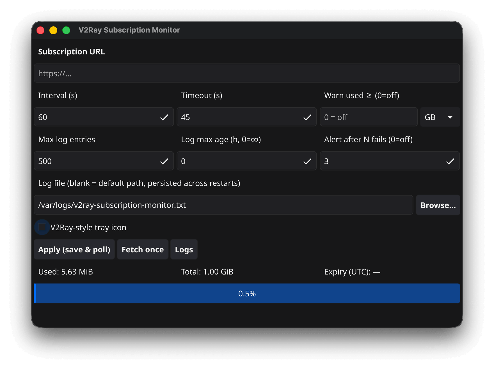

# V2Ray subscription usage monitor

Desktop app that **polls a subscription URL** (HTTP GET), reads traffic counters from the **`Subscription-Userinfo`** response header, and shows **used / total** (and optional expiry) in the window and in the **system tray**. Built with **[Fyne](https://fyne.io/)** (Go + GLFW).

*This project is fully vibe-coded.*



## Features

- Configurable **poll interval**, **request timeout**, and subscription URL (persisted locally).
- **Tray icon** with quota text (where the OS supports it), tooltip, and a menu (**Settings** opens the window, **Quit** exits).
- Optional **V2Ray-style** monochrome tray icon from `assets/icons/v2ray.svg` (theme-colored stroke).
- **Usage warning** when “used” crosses a threshold in MB or GB (one dialog until usage drops below the threshold).
- **Alert after N consecutive failed updates** (default 3, configurable; one dialog until a successful fetch).
- **Request log** with retention limits (max entries, optional max age).
- On **macOS**, closing the window can **hide to tray** (accessory activation policy) so the app stays menu-bar-only until you open **Settings** or quit from the tray.

## Requirements

- **Go** (see `go.mod` for the toolchain version; currently **1.25**).
- **CGO** and a working C toolchain — required **only for the Fyne GUI** (`go run .`, `make build`).
- Platform packages as per [Fyne’s install guide](https://developer.fyne.io/started/).

## Binary size: why ~20+ MB for the GUI, and how to get ~5 MB

The **desktop app** bundles **[Fyne](https://fyne.io/)**, which pulls in **GLFW**, **OpenGL**, font shaping, and a large standard widget stack. Even with `-s -w`, `-trimpath`, and `CGO_CFLAGS=-Os`, a stripped macOS/arm64 build is typically on the order of **~20–25 MiB**. That is normal for this class of toolkit, not a misconfiguration.

**A ~5 MiB target is not realistic** for that full GUI without **replacing Fyne** (e.g. tray-only + config file, TUI, or a browser-based UI). Stripping and linker flags only remove debug metadata; most of the size is the UI/runtime you asked for.

This repo ships a second artifact that matches the “small binary” goal:

| Artifact | Role | CGO | Typical stripped size |
|----------|------|-----|------------------------|
| **`v2ray-subscription-monitor`** | Window + system tray + prefs | **Yes** | ~20–25 MiB (platform-dependent) |
| **`v2ray-subscription-cli`** | One-shot GET + print usage (`Subscription-Userinfo`) | **No** | **~5–6 MiB** |

Build the CLI:

```bash
make build-cli
# ./v2ray-subscription-cli -url 'https://…' [-timeout 45] [-json]
```

Use **`-json`** for machine-readable output (scripts, monitoring). The CLI reuses `internal/subscription` and does not link Fyne.

## Run and build

```bash
go run .
# or (recommended: smaller binary — strip debug, trim paths, omit VCS stamp, CGO -Os)
make build
# writes ./v2ray-subscription-monitor (Darwin: also suppresses duplicate -lobjc ld warning)
```

For a **larger unstripped** binary (better stack traces / debuggers), use `make build-debug`.

Plain `go build` does not apply those flags unless you pass them yourself. The **Makefile** applies the full set (including an Apple-only linker quiet flag on Darwin). **`.vscode/settings.json`** uses the portable subset (`-buildvcs=false`, `-trimpath`, `-s -w`) so Linux/Windows dev machines do not need Apple `ld` options.

First run: enter your subscription URL, set options, then **Apply & start polling**. If a URL is already saved, polling starts shortly after launch.

## Release binaries (`dist/`)

The **Makefile** can place cross-built artifacts under **`dist/`** (gitignored):

| Target | Output |
|--------|--------|
| `make dist` / `make dist-all` | **On macOS:** darwin **`.dmg`** (amd64 + arm64), plus **Linux `.AppImage`** targets (build on Linux to produce them) + Windows binaries. **On Linux:** same matrix, and **GUI Linux output is `dist/*.AppImage`** ([AppImage](https://appimage.org/); see `installer/linux/build-appimage.sh`). **On Windows:** adds **`dist/*-setup.exe`**. **Elsewhere:** darwin/windows loose binaries; Linux AppImages require a Linux host (matching arch). |
| `make dist-darwin-amd64.dmg` / `dist-darwin-arm64.dmg` | **macOS only** — `fyne package` + [create-dmg](https://github.com/sindresorhus/create-dmg) (drag app to **Applications**). Needs **Node.js** for `npx`. Not notarized. |
| `make dist-windows-installers` / `dist-windows-amd64-setup` / `dist-windows-arm64-setup` | **Windows only** — builds `dist/...-setup.exe` after the matching portable `.exe`. Requires **Inno Setup** (`ISCC.exe`; override with `make ISCC=...`). |
| `make dist-darwin` | macOS GUI outputs (`.dmg` when host is macOS) |
| `make dist-linux` | Linux only — **`dist/v2ray-subscription-monitor-linux-{amd64,arm64}.AppImage`** |
| `make dist-windows` | Windows portable `.exe` plus **setup installers** when host is Windows |
| `make dist-darwin-arm64`, etc. | Single architecture (macOS: builds toward `.dmg` when on Darwin) |
| `make clean-dist` | Remove `dist/` |
| `make dist-cli-all` | Six **CLI** binaries (`v2ray-subscription-cli-*`, **no CGO** — easy cross-compile) |
| `make dist-cli-darwin`, `dist-cli-linux`, `dist-cli-windows` | CLI per OS |
| `make dist-cli-darwin-arm64`, etc. | Single CLI architecture |

Cross-compiling **Fyne** to another OS usually needs a matching **C cross-compiler** and often `CC` / `CXX`. A common pattern is a **CI matrix** (one job per OS) running the corresponding `make dist-*` target on a native runner. **CLI** archives can be built from any host with `make dist-cli-all` (`CGO_ENABLED=0`).

On **Linux**, packaging the GUI as an **AppImage** uses `installer/linux/build-appimage.sh` (downloads [linuxdeploy](https://github.com/linuxdeploy/linuxdeploy) + [appimagetool](https://github.com/AppImage/AppImageKit) into `.cache/appimage-tools/`). Install the same build deps as in CI **plus** `patchelf`; use `librsvg2-bin` if `assets/icons/v2ray-subscription-monitor.png` is absent (icon is generated from `v2ray.svg`). The host CPU must match the target (`amd64` on x86_64, `arm64` on aarch64).

## Subscription-Userinfo

The client expects the provider to return a **`Subscription-Userinfo`** header on a successful GET, with semicolon-separated keys such as `upload`, `download`, `total`, and optionally `expire` (Unix timestamp). Parsing is implemented in `internal/userinfo`.

## Layout

| Path | Role |
|------|------|
| `main.go` | UI, polling loop, tray, preferences, dialogs |
| `internal/subscription` | HTTP fetch |
| `internal/userinfo` | Header parsing |
| `internal/logbuf` | Log ring buffer + age policy |
| `internal/trayicon` | SVG → themed PNG for tray |
| `internal/trayquit` | Systray teardown helper (desktop) |
| `internal/platform` | macOS tray/Dock activation (CGO) |
| `cmd/v2ray-subscription-cli` | Small headless probe (no Fyne) |
